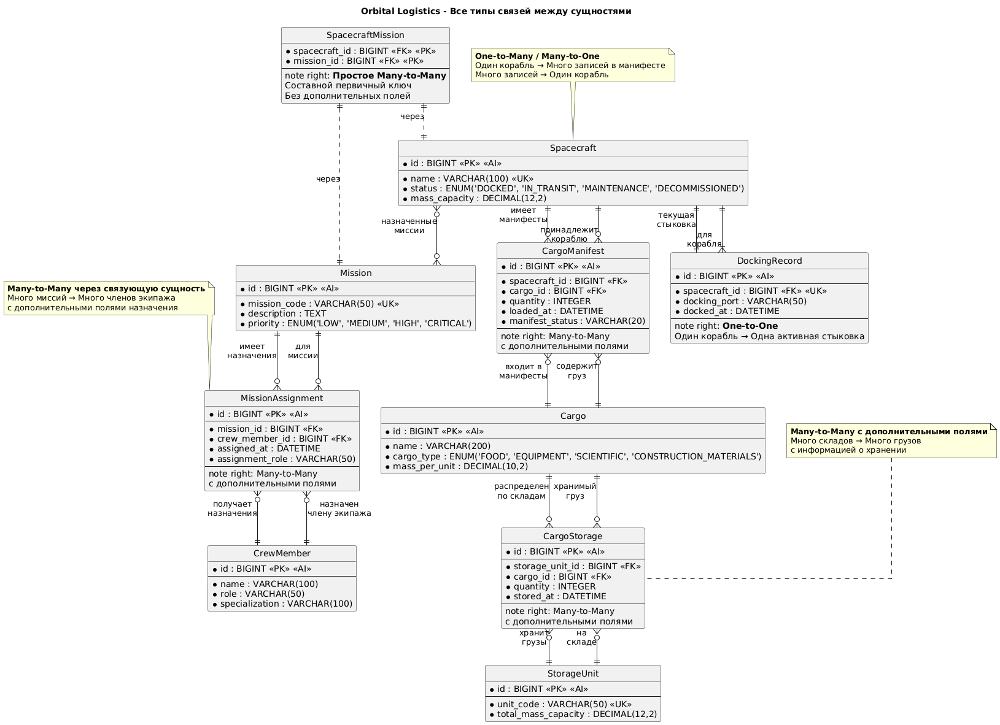

### Схема БД

### Описание сущностей

| Сущность | Назначение | Ключевые поля |
|----------|------------|---------------|
| **Spacecraft** | Учет космических кораблей | name, registry_code, mass_capacity, status |
| **Cargo** | Каталог грузов | name, cargo_type, mass_per_unit, expiration_date |
| **StorageUnit** | Складские модули станции | unit_code, total_mass_capacity, current_mass |
| **CrewMember** | Персонал станции | name, role, specialization |
| **Mission** | Космические миссии | mission_code, priority, description |

### Типы связей

#### 1. One-to-Many / Many-to-One

- **Spacecraft → CargoManifest**: Один корабль может иметь много записей в манифесте
- **Cargo → CargoManifest**: Один tтип груза может входить в разные манифесты

#### 2. Many-to-Many с дополнительными полями

- **Mission ↔ CrewMember** (через MissionAssignment): Миссии назначаются экипажу с указанием ролей
- **StorageUnit ↔ Cargo** (через CargoStorage): Грузы распределяются по складам с учетом количества

#### 3. Many-to-Many (простое)

- **Spacecraft ↔ Mission**: Корабли могут выполнять несколько миссий

#### 4. One-to-One

- **Spacecraft ↔ DockingRecord**: Каждый корабль имеет одну активную запись стыковки

### Бизнес-логика

Система поддерживает:

- ✅ Учет грузопотоков между Землей и станцией
- ✅ Распределение грузов по складским модулям
- ✅ Планирование миссий и назначение экипажа
- ✅ Контроль стыковок и логистических операций
- ✅ Аудит складских запасов и перемещений грузов